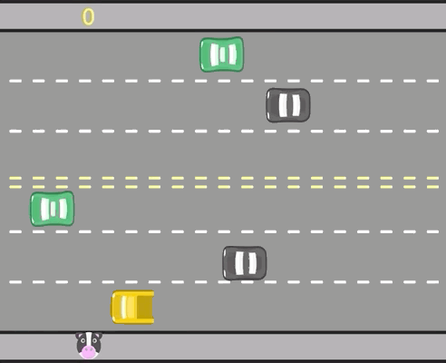

<h1 align="center"> FREEWAY EM JAVASCRIPT </h1>

Projeto final desenvolvido e ofericido pela cursoLógica de programação: laços e listas com JavaScript  criado e ensinado pela plataforma alura 

 

  

## 🚀 Tecnologias

Esse projeto foi desenvolvido com as seguintes tecnologias:

- JavaScript 

## 💻 Projeto

Jogo Freeway feito como projeto final do curso LLógica de programação: laços e listas com JavaScript 

---

Feito com ♥ by Alura 
